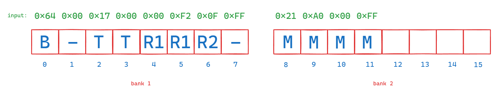

# Sistemas Embebidos: Laboratorio 0
**Autor: Josmar Dominguez 16-10315**

Éste primer laboratorio se centra en trabajar con estructuras de datos y técnicas útiles al momento de programar microcontroladores y dispositivos que requieren atención en la optimización de memoria, eficiencia de ejecución, y demás características importantes al momento de diseñar un sistema embebido.


# Parte 1. Tipos de datos y estructuras

## Enunciado

Sea un sistema embebido que se encarga de la medición del nivel de agua en hogar; para ello se tiene un microcontrolador de `8 bits` conectado a un sensor especificado de dirección `0xA0` en los puertos SDA y SCL utilizando el protocolo de comunicación `i2c`. Al solicitarle una medición, el mismo envía un paquete de `12 bytes`, que según las especificaciones del fabricante se corresponden con los siguientes valores.
| Posición de los bytes | Significado                         | Signo     |
|-----------------------|-------------------------------------|-----------|
| 0                     | Nivel de la batería del dispositivo | Sin signo |
| 1-2                   | Temperatura ambiental               | Con signo |
| 3-4-5                 | Nivel del tanque de agua de reserva | Con signo |
| 6-7-8-9               | Nivel del tanque de agua principal  | Sin signo |
| 10-11                 | Checksum a 2 bytes                  | Sin signo |

Una función inherente al sistema se encarga de pedir y convertir la información, entregando un arreglo (`array[N]`) de longitud `N = 12`. Dicho arreglo es la entrada de *una función* que usted debe impolementar con las siguientes características:
* El argumento de entrada debe corresponder a un arreglo o puntero de tipo `uint8_t`.
* Devuelve una estructura con los tipos que usted considere pertinentes para ordenar la información según los requerimentos.
* Debe contener al menos una redefinición de variables usando `typedef`.


## Solución
`water.c`
Lo primero que se define es la **estructura** para almacenar y presentar los datos del sensor, basándose en la tabla.
Cada `byte` está compuesto por `8 bits`, por lo que debemos usar los siguientes tipos de variables dentro de la estructura **`sensorData`**:
```
uint8_t  battery_level;			// Un byte
int16_t  ambient_temperature;	// Dos bytes
int32_t  reserve_tank_level;	// Cuatro bytes (se usan 3)
uint32_t  main_tank_level;		// Cuatro bytes
uint16_t  checksum;				// Dos bytes
```

Luego, para hacer la asignación, se aprovecha el concepto de `union` en C para asignar cada conjunto de bytes a una variable diferente de manera automática, al compartir el mismo espacio en memoria.
Originalmente se pensó en una solución del siguiente tipo:
```
typedef  union  SensorUnion  {
	uint8_t  raw_data[12]; // Input data
	struct  {
		uint8_t  battery_level; 		// Byte 0: Battery level
		uint16_t ambient_temperature; 	// Bytes 1-2: Ambient temperature
		uint16_t reserve_tank_level_1; 	// Bytes 3-4: Reserve tank level (1)
		uint8_t  reserve_tank_level_2;	// Byte 5: Reserve tank level (2)
		uint32_t main_tank_level; 		// Bytes 6-9: Main tank level
		uint16_t checksum; 				// Bytes 10-11: Checksum
	}  fields;
}  SensorUnion;
```
Sin embargo, se presentó un problema por ***padding***. En los sistemas de 32 bits, los *memory banks* a los que accede el procesador son de `4 bytes` (`8 bytes` para 64 bits), por lo que por directrices del procesador, C agrega un elemento de *podding* sin valor, para que los datos se almacenen en bloques de `4 bytes`, y la lectura sea más eficiente. En caso de guardar en un banco, `3 bytes`, por ejemplo, `uint8_t + uint16_t`, esto ocupará en realidad `4 bytes`, pues después del dato de `8 bits` agregará un *padding*. El problema con esto es que al usar una unión, el `byte 1`, correspondiente al primer byte de la temperatura ambiental, se sobreescribe con un *padding*, y la temperatura ambiente pasa a guardar los datos de los bytes 2 y 3. Algo como lo que se observa en la siguiente imagen:



Hay múltiples técnicas para indicarle al sistema operativo que procese el *padding* de forma diferente, pero esto depende del OS y de la arquitectura del procesador. Por lo que se optó por segmentar los datos en la unión usando sólo `uint8_t` en formas de arreglos para cada dato, y luego asignarlos a las variables de la estructura **`sensorData`**.
```
typedef union SensorUnion {
    uint8_t raw_data[12];           // Input data
    struct {
        uint8_t     battery_level;          // Byte 0: Battery level
        uint8_t     ambient_temperature[2]; // Byte 1: Ambient temperature (1)
        uint8_t     reserve_tank_level[3];  // Byte 2: Reserve tank level (2)
        uint8_t     main_tank_level[4];     // Byte 3: Main tank level
        uint8_t     checksum[2];            // Byte 4: Checksum
    } fields;
} SensorUnion;
```

Además, se definió una función `mergeBytes` para unir los bytes de un arreglo de `uint8_t` en un solo `uint32_t`, que se usará para los datos de los tanques de agua.

Con esto se logra la correcta asignación byte a byte en los bancos de memoria, y que se pueda acceder a los datos de manera correcta, correspondiendo con los requisitos del fabricante.

# Parte 2. Tipos abstractos de datos - Pilas / Stack

## Enunciado
En un dispositivo embebido se tienen configuradas una serie de interrupciones asociadas a los diversos pines de entrada de propósito general (GPIO). Un vector de interrupción manejado por el microcontrolador se encargará de entregar las interrupciones de forma individual a la pila implementada anteriormente. Se debe entonces diseñar una función que cumpla con los siguientes requerimentos:
* La entrada de la función corresponde a la salida de los ítems de una pila.
* La función acepta de entrada una referencia a una estructura de tipo ítem.
* La salida de la función será de tipo entero y dependerá de la interrupción ejecutada.
* La entrada es un arreglo de tamaño N y puede contener cualquiera de las siguientes instrucciones en orden aleatorio:

| Instrucción | Acción                                                      |
|-------------|-------------------------------------------------------------|
| 0x00        | Hacer *toggle* de una variable booleana para el PIN 1       |
| 0x01        | Imprimir el valor del PIN 1                                 |
| 0x02        | Aumentar un contador de tipo `size_t`                       |
| 0x03        | Imprimir el contador                                        |
| 0x05        | Verificar el número de ítems que hay en la pila             |
| 0x06        | Si la pila está llena, finalizar la ejecución del programa  |

## Solución

### Pila estática
`static_stack.c`
La pila estática se caracteriza por tener un tamaño fijo, sin que pueda modificar su tamaño en el tiempo de ejecución. De esta manera el espacio ocupado en memoria es reservado desde el inicio de la ejecución.

Para implementar una pila estática se usaron dos estructuras de datos:
* **Stack**, que almacena los ítems de la pila y su tamaño actual.
* **Item**, que almacena únicamente el valor del ítem.

Al ser una pila, se deben implementar funciones para agregar elementos al tope, y quitarlos de la misma, siguiendo el principio de *'el último que entra, es el primero que sale'*, como en una pila de platos.

Para ello se implementaron las funciones para inicializar la pila, simplemente definiendo el tamaño en 0, y luego las funciones de `push` y `pop`, para ingresar y extraer elementos de la pila, respectivamente.

Como funciones adicionales se crearon `isFull` y `isEmpty` para verificar si la pila está llena o vacía, respectivamente, basándose en el tamaño actual de la pila.

### Pila dinámica
`dynamic_stack.c`
La pila dinámica por su parte se caracteriza por no tener un tamaño fijo, aunque éste se pueda limitar. En el tiempo de ejecución el tamaño que ocupa en memoria puede variar, reservando (`malloc`) o liberando (`free`) espacio en memoria según sea necesario.

En este caso, para implementar la pila dinámica también se usaron dos estructuras de datos:
* **Stack**, que almacena el tamaño de la pila y un puntero al primer ítem.
* **Item**, que almacena el valor del ítem y un puntero al siguiente ítem.

En este caso se implementó una función `createStack` para crear una pila vacía, y luego las funciones `push` y `pop` para agregar y quitar elementos de la pila, respectivamente, usando `malloc` y `free` para reservar y liberar memoria, respectivamente. Adicionalmente se agregó un límite de 10 elementos, y se implementaron las funciones `isFull` y `isEmpty` para verificar si la pila está llena o vacía.

### Interrupciones
Para las interrupciones se definieron dos variables, `int pin_1`, que almacena el valor que sale por el PIN 1 GPIO. Y `size_t counter`, que almacena el valor del contador, inicializados ambos en 0.

Además, se empleó una enumeración para hacer el *mapeo* de las instrucciones a los valores hexadecimales, y se implementó una función `processInterruption` que recibe un stack y una instrucción, ejecutándo dicha instrucción.
Esta función consta de un `switch` que toma las siguientes decisiones basadas en la tabla de instrucciones:
* `0x00`: Cambia el valor de `pin_1` a su valor negado.
* `0x01`: Imprime el valor de `pin_1`.
* `0x02`: Aumenta el valor de `counter` en 1.
* `0x03`: Imprime el valor de `counter`.
* `0x05`: Imprime el tamaño de la pila.
* `0x06`: Si la pila está llena, finaliza el programa.

Un comentario sobre la última instrucción es que la pila nunca estará llena, pues al sacar una instrucción para ejecutarla, se libera espacio en la pila, por lo que lo más grande que estará la pila al procesar una instrucción es de `MAX_SIZE - 1`.